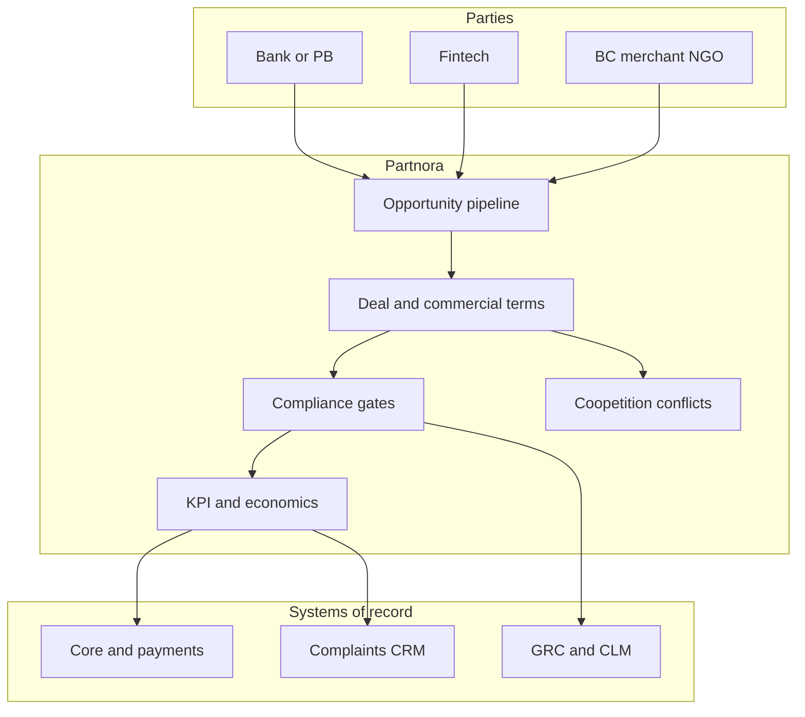

# Partnora

**Source:** `ai-in-financial/deloitte-in-fs-deloitte-banking-colloquium-thoughtpaper-cii/`
**Domain:** `ai-fin`
**One-liner:** An India banking partnership operating system that helps incumbent banks, payments banks, and fintechs structure, govern, and measure coopetition deals across inclusion, payments, and digital distribution—so Vision 2020-style collaboration becomes a managed portfolio rather than a press-release.
**Wedge:** Partnership and digital strategy offices at Indian scheduled commercial banks, payments banks, and regulated fintechs navigating RBI-shaped models (payments banks, small finance banks, on-tap licensing) and Digital India / Jan Dhan / Aadhaar-linked distribution.
**Positioning:** Regional banking colloquium use cases—India inclusion and payments-bank partnership fabric. Distinct from Alliora (generic fintech alliance shopping) and Morphora (CIO dual-speed ops): Partnora owns the commercial and compliance anatomy of bank–PB–fintech–BC–NGO deals in the Indian regulatory frame described by the CII–Deloitte Vision 2020 colloquium paper.

## Market research synthesis

### Thesis from source

*Banking on the Future: Vision 2020* (CII–Deloitte) argues Indian banking cannot stay the same under customer, regulatory, technology, demographic, competitive, and economic forces. Inclusive growth, Digital India (July 2015), infrastructure credit (~Rs 10 trillion / ~15% of advances by March 2016, ~25% CAGR over prior decade), stressed PSU assets, INDRADHANUSH, bankruptcy law, and Bank Boards Bureau set the macro stage. Entry barriers fall as specialised entrants and fintechs blur business and technology; value from acquisition and product push is short-lived versus technology and external partnerships.

The report’s distinctive operating focus—beyond generic “innovation”—is **payments banks (PBs)** and **partnerships**. PBs (often telco/wallet licensees) target unbanked and cash-heavy segments, accept deposits up to INR 1 lakh, remittances, ATM cards, subsidy transfers, merchant acquiring, and mobile-led last mile (~1000 Mn mobile subscribers as reach thesis). They cannot lend like small finance banks yet pay interest—so viability depends on technology-led, asset-light, cashless models and multi-channel presence for tech-savvy youth, financially excluded cash users, and digitally non-savvy included customers. Partnership types span banks, merchants, BCs, NGOs (awareness and scale), and fintechs; illustrative models include Fino–BPCL style distribution. Success factors emphasise brand-aligned partners, last-mile connectivity, coopetition with fintech startups, and clear understanding of who leads in asymmetric relationships (bank scale/compliance vs fintech agility). Parallel tracks cover M&A consolidation under RBI amalgamation directions and technology themes (cognitive/AI, blockchain, RPA, cyber)—but the commercially sharp wedge is partnership governance for inclusion and payments economics.

Partnora therefore sells a partnership lifecycle system: opportunity sensing under Indian regulatory postures, term-sheet and KPI templates for PB/fintech/BC/NGO deals, compliance checklists (RBI/data/outsourcing), performance against inclusion and unit-economics metrics, and coopetition conflict management when partners also compete.

### Buyer & economic model

- **Primary buyer:** Chief Partnership / Digital / Inclusive Banking Officer at an Indian bank or payments bank CEO office.
- **Users:** alliance managers, product owners (payments, remittance, savings), compliance/outsourcing officers, BC network managers, fintech relationship managers, finance (unit economics), state/regional inclusion leads.
- **Budget owner / value metric:** partnership P&L and inclusion KPIs (accounts activated, digital transactions, last-mile cost per active customer, remittance volume). Secondary: time-to-live for new partner integrations.
- **Competing status quo:** MoUs without KPIs; spreadsheet trackers; legal paper after sales handshake; fintech “innovation days” that never clear compliance; PB distribution deals that ignore deposit-cap and non-lending constraints.

### Domain constraints

- **Regulatory / trust / safety:** RBI licensing boundaries (PB deposit caps, no credit book), outsourcing guidelines, data localisation/privacy expectations, AML/KYC on assisted models, competition law in coopetition, consumer protection on mis-selling via partners.
- **Data sensitivity:** Aadhaar-linked and demographic data, transaction histories shared across partners; need purpose-limited data rooms.
- **Change-management realities:** banks fear disintermediation; fintechs fear slow procurement; PBs need volume yesterday. Partnora must encode asymmetric roles and SLA/exit clauses up front.

## Business requirements

- BR-1: Every partnership must declare regulatory posture (PB, SFB, bank, NBFC, fintech, BC, NGO) and prohibited activities (e.g. PB lending) as hard constraints.
- BR-2: Deals must encode commercial model (revenue share, fee, cost-per-activation), inclusion KPIs, and exit/wind-down terms before go-live.
- BR-3: Compliance checklists appropriate to RBI outsourcing and data-sharing must gate launch; incomplete checklists cannot be marked live.
- BR-4: Coopetition conflicts (partner competes on overlapping products) must be logged with mitigation (exclusivity windows, Chinese walls, customer ownership rules).
- BR-5: Last-mile channel performance (BC, merchant, telco, NGO) must be measurable at partner and geography grain.
- BR-6: Customer ownership and complaint liability must be explicit per journey step.
- BR-7: Data shared with partners must carry purpose limitation and retention aligned to the deal; bulk export outside purpose is blocked.
- BR-8: M&A or consolidation scenarios that inherit partnerships must trigger portfolio reassessment workflows.
- BR-9: Unit economics (cost to acquire/serve vs float/fee income under PB constraints) must be reportable monthly.
- BR-10: Innovation tech pilots (AI/RPA/blockchain/cyber) attached to a partnership must reference a parent deal and cannot orphan as shadow IT.
- BR-11: Audit exports must show active deals, compliance gate status, incidents, and KPI attainment for board and regulator inquiries.
- BR-12: Partnora does not process payments itself; it governs partnership operations that sit atop core/payments systems.

## User stories

Canonical user stories live in sibling [USER_STORIES.md](USER_STORIES.md).

## System design

### Overview

Partnora manages the partnership lifecycle for Indian banking collaboration: opportunity intake, regulatory posture validation, commercial and compliance packaging, launch gates, KPI monitoring, conflict management, and exit. Payment and account systems remain systems of record; Partnora orchestrates the multi-party operating agreement.

### Actors & boundaries

- **Actors:** bank/PB partnership teams, fintechs, BCs, merchants, NGOs, compliance, finance, customers (indirect via journeys).
- **Trust boundary:** each party sees deal data need-to-know; competitors in coopetition do not see each other’s full commercial terms.
- **Human-in-the-loop points:** deal approval, compliance gate waiver (rare), conflict mitigation acceptance, exit decision.

### Core capabilities

1. **Opportunity pipeline** — partner types and regulatory postures.
2. **Deal workspace** — commercial terms, KPIs, exits.
3. **Compliance launch gates** — outsourcing, KYC/AML, data.
4. **Coopetition conflict register**.
5. **Channel performance** — BC/merchant/telco/NGO.
6. **Customer ownership and complaints routing**.
7. **Data-purpose registers**.
8. **Unit-economics reporting**.
9. **Pilot attachment** — AI/RPA/etc. under parent deals.
10. **Audit and board export**.

### Conceptual data

- **Primary entities:** Partner, RegulatoryPosture, Opportunity, Deal, CommercialTerm, InclusionKPI, ComplianceGate, Conflict, ChannelNode, CustomerOwnershipRule, DataPurpose, EconomicsSnapshot, Pilot, Incident, AuditExport.
- **Critical events:** opportunity scored, deal drafted, gate passed/failed, deal launched, KPI breached, conflict logged, exit started, audit exported.
- **Retention / audit needs:** deal and compliance evidence retained for regulatory and commercial dispute windows; personal data in shared rooms minimised and purpose-bound.

### Integrations (conceptual)

- **Systems of record:** core banking / PB ledgers, payments switches, BC management systems, CRM/complaint systems, contract/CLM, GRC.
- **Upstream signals:** activation events, transaction volumes, complaint tickets, partner security attestations.
- **Downstream actions:** launch approvals, remediation plans, renewals/exits, board inclusion reports.

### High-level architecture

### Success metrics

- **Leading:** % deals with complete gates before launch; time-to-launch; KPI coverage; conflict register freshness; data-purpose completeness.
- **Lagging:** active customer cost-to-serve; inclusion activation and dormancy; partner-attributable digital transaction growth; compliance incidents per live deal; successful exits without customer harm.

## OpenAPI skeleton

Canonical HTTP surface lives in sibling [openapi.yaml](openapi.yaml). Summary:

- **Base path:** `/v1/...`
- **Auth:** Bearer JWT for alliance operators; `X-API-Key` for KPI event ingestion from channels.
- **Resource groups:** Partners, Opportunities, Deals, Gates, Channels, Conflicts, Economics, Audits.
