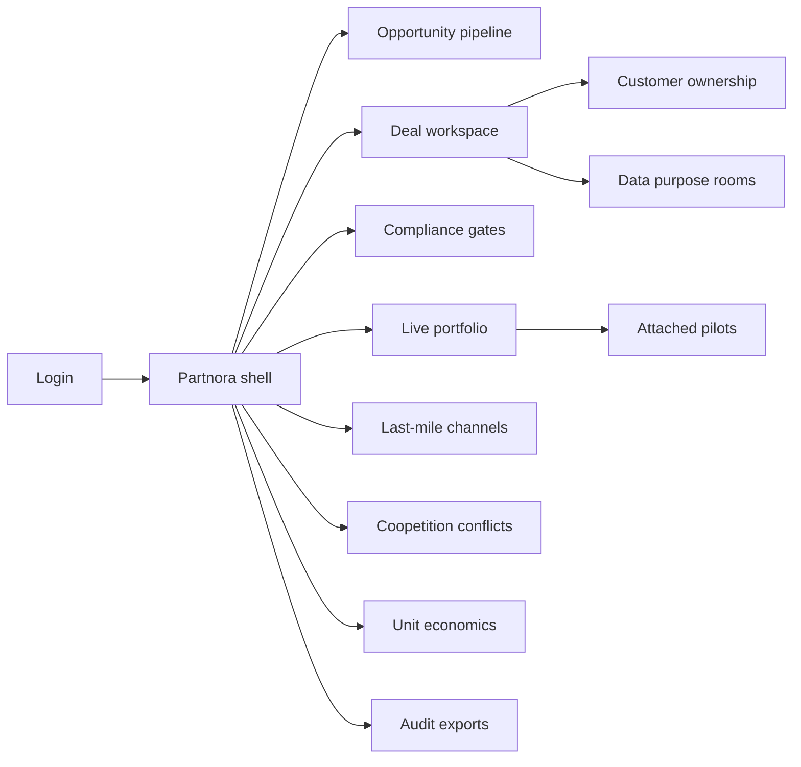
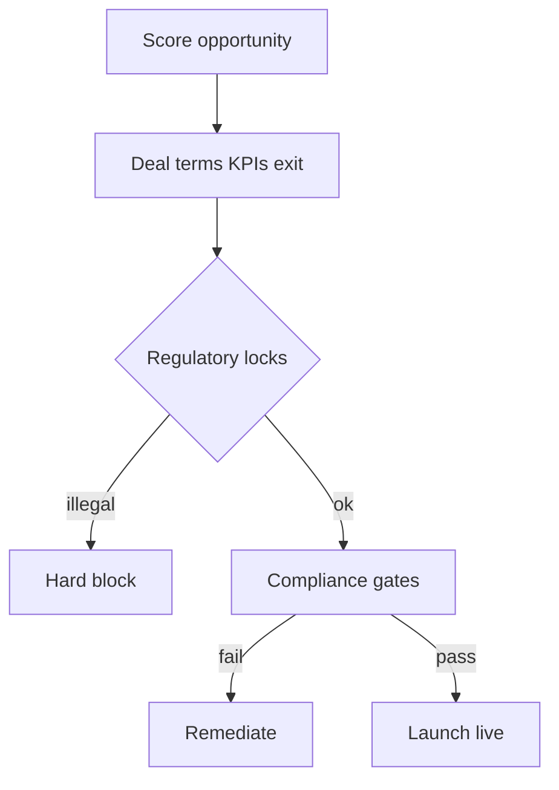

# Partnora — Web app

**Product:** [PRODUCT.md](./PRODUCT.md)
**Primary surface:** India banking partnership operating system (pipeline → deal gates → live KPI/coopetition portfolio)
**Secondary surfaces:** Board/regulator audit export viewer; fintech evidence-pack share room (time-boxed)
**Design thesis:** Partnora is a coopetition deal floor for Indian bank–payments-bank–fintech–BC–NGO collaboration—not a CIO dual-speed map (Morphora), not a generic alliance shop, and not a payments switch. The metaphor is a bazaar ledger under a regulatory shamiana: warm sandstone ground, peacock teal for inclusion KPIs, saffron for compliance gates still open, and indigo stamps for prohibited-activity locks (PB cannot lend). Asymmetric roles (bank scale vs fintech agility) are drawn as two columns on every term sheet. The Partnora wordmark is peacock teal on every live deal so Vision 2020 partnerships become managed portfolios, not press releases.

## UX research synthesis

### Category peers (best-in-class)

- **Salesforce Partner Relationship Management / Prismatic-style partner portals:** Pipeline and deal stages with SLA clocks. Steal: opportunity scoring and time-to-live visibility for fintechs (BR-2); reject generic SaaS partner chrome without RBI posture locks.
- **IDfy / onboarding GRC checklists in Indian FS:** Outsourcing and KYC gate patterns. Steal: launch blocked until checklist complete (BR-3); reject “innovation day” bypass.
- **BC / agent network consoles (e.g. bank BC MIS patterns):** Activation and dormancy by geography. Steal: last-mile grain at partner and village cluster (BR-5); reject vanity national totals only.
- **Contract lifecycle tools (Icertis-class) for financial alliances:** Exit/wind-down and liability clauses. Steal: customer ownership and complaint liability per journey step (BR-6); reject MoU-without-KPI trackers.

### Patterns to adopt / reject

- **Adopt:** Regulatory posture + prohibited activities as hard UI locks; commercial + inclusion KPIs + exit before go-live; coopetition conflict register; data-purpose rooms; PB unit economics; pilot-must-have-parent-deal; audit exports.
- **Reject:** Morphora shapeshifter compass as home; payment processing screens; global “fintech mall” without India licensing postures; decorative MoU galleries.

### Trust, density, and workflow constraints from PRODUCT.md

Banks fear disintermediation; fintechs fear slow procurement; PBs need volume—encode asymmetric roles and exit up front. Coopetition parties must not see each other’s full commercial terms. Partnora does not process payments (BR-12).

## Information architecture

### Nav model

### Roles → default home

| Role | Default home | Why |
|------|--------------|-----|
| Head of partnerships | Opportunity pipeline / live portfolio | Fit + KPI remediation |
| Payments bank product lead | Deal workspace + economics | Deposit-cap / non-lending locks |
| Compliance / outsourcing | Compliance gates | Launch gating (BR-3) |
| BC / inclusion network manager | Last-mile channels | Activation/dormancy real |
| Fintech relationship manager | Deal SLA + evidence pack | Procurement visibility |
| Finance partner | Unit economics | Inclusion that destroys value |

### Cross-links to OpenAPI resources

| Nav area | OpenAPI tags / resources |
|----------|---------------------------|
| Partner master | Partners |
| Pipeline | Opportunities |
| Commercial / KPI / exit | Deals |
| Launch checklists | Gates |
| BC/merchant/telco/NGO performance | Channels |
| Overlap / Chinese walls | Conflicts |
| PB float/fee economics | Economics |
| Board / regulator | Audits |

## Screen inventory

### Opportunity pipeline

- **Purpose:** Score PB/fintech/BC/NGO opportunities on fit and regulatory risk—stop decorative MoUs.
- **Entry:** Partnerships head default.
- **Layout regions:** Pipeline board; posture chips (PB/SFB/bank/NBFC/fintech/BC/NGO); risk score; prohibited-activity warnings; next gate estimate.
- **Primary actions:** Advance stage; open deal draft; kill decorative MoU; request compliance pre-screen.
- **Empty / loading / error:** Empty = import partner types template; error = GRC sync.
- **BR / story ties:** BR-1; partnerships head stories.

### Deal workspace

- **Purpose:** Encode commercial model, inclusion KPIs, exit/wind-down before go-live; asymmetric role columns.
- **Entry:** From pipeline; PB product lead.
- **Layout regions:** Two-column roles (bank vs partner); revenue share/fee/CPA terms; inclusion KPI set; exit terms; PB deposit-cap / non-lending lock banner.
- **Primary actions:** Save draft; submit to gates; simulate illegal product block; attach parent for pilots.
- **Empty / loading / error:** Missing exit or KPIs block submit (BR-2); PB lending attempt hard-blocked (BR-1).
- **BR / story ties:** BR-1, BR-2; PB product stories.

### Compliance launch gates

- **Purpose:** RBI outsourcing, KYC/AML, data-sharing checklists gate launch.
- **Entry:** Compliance default; deal submit.
- **Layout regions:** Checklist; evidence attachments; waiver (rare, dual); gate status stamp; cannot-mark-live if incomplete.
- **Primary actions:** Pass item; fail with remediation; approve launch; refuse incomplete live (BR-3).
- **Empty / loading / error:** Incomplete = saffron open-gate state.
- **BR / story ties:** BR-3; compliance stories.

### Live partnership portfolio

- **Purpose:** KPI dashboards per live deal; underperformers face remediation or exit.
- **Entry:** Partnerships head; monthly rhythm.
- **Layout regions:** Deal cards with KPI health; remediation plans; renewal countdown; coopetition flag.
- **Primary actions:** Open remediation; start exit; renew with conflict review.
- **Empty / loading / error:** Empty live = pipeline CTA; KPI feed lag banner.
- **BR / story ties:** Partnerships KPI story; BR-2.

### Last-mile channel performance

- **Purpose:** BC/merchant/telco/NGO metrics at partner and geography grain.
- **Entry:** BC network manager.
- **Layout regions:** Map/cluster table; activation; dormancy; corridor remittance (where relevant); node health.
- **Primary actions:** Invest/divest node; open complaint ownership; export inclusion proof.
- **Empty / loading / error:** National-only totals discouraged—prompt for grain (BR-5).
- **BR / story ties:** BR-5; BC manager stories.

### Customer ownership and complaints

- **Purpose:** Explicit ownership and complaint liability per journey step—no bounce between bank and partner.
- **Entry:** From deal; BC/care.
- **Layout regions:** Journey step matrix; owner party; liability; routing rules; SLA.
- **Primary actions:** Publish routing; test complaint path; escalate mis-route.
- **Empty / loading / error:** Unowned step blocks launch (BR-6).
- **BR / story ties:** BR-6.

### Coopetition conflict register

- **Purpose:** Log overlapping products with mitigations (exclusivity, Chinese walls, ownership rules) before renewal.
- **Entry:** Conflicts nav; renewal gate.
- **Layout regions:** Conflict list; overlap map; mitigation status; need-to-know commercial redaction.
- **Primary actions:** Log conflict; accept mitigation; block renewal if stale (BR-4).
- **Empty / loading / error:** Freshness SLA breach = indigo warning.
- **BR / story ties:** BR-4; partnerships coopetition story.

### Data-purpose rooms

- **Purpose:** Purpose limitation and retention per partner; block bulk export outside purpose.
- **Entry:** Compliance; deal data tab.
- **Layout regions:** Purpose register; attribute lists; retention; export attempts log; Aadhaar-linked caution.
- **Primary actions:** Grant purpose; revoke; block unlawful export (BR-7).
- **Empty / loading / error:** Missing purpose blocks share.
- **BR / story ties:** BR-7.

### Unit economics (PB-aware)

- **Purpose:** Cost to acquire/serve vs float/fee income under PB constraints—monthly.
- **Entry:** Finance partner default.
- **Layout regions:** Economics table; PB constraint overlays; deal redesign triggers; stop/redesign CTAs.
- **Primary actions:** Close month; flag value-destroying inclusion; export.
- **Empty / loading / error:** Missing fee/float inputs = incomplete (BR-9).
- **BR / story ties:** BR-9; finance stories.

### Pilot attachment board

- **Purpose:** AI/RPA/blockchain/cyber pilots must reference a parent deal—no orphan shadow IT.
- **Entry:** From live deal; innovation liaison.
- **Layout regions:** Pilot list; parent deal link; orphan scanner.
- **Primary actions:** Attach parent; quarantine orphan; promote with deal gate.
- **Empty / loading / error:** Orphan = case open (BR-10).
- **BR / story ties:** BR-10.

### M&A partnership reassessment

- **Purpose:** Consolidation inheriting partnerships triggers portfolio reassessment.
- **Entry:** Admin/event; board.
- **Layout regions:** Inherited deal list; posture conflicts; reassessment workflow.
- **Primary actions:** Start reassessment; exit/renegotiate; merge gates.
- **Empty / loading / error:** Unassessed inherited deals block “steady state” claim (BR-8).
- **BR / story ties:** BR-8.

### Audit and board export

- **Purpose:** Active deals, gate status, incidents, KPI attainment for board/regulator.
- **Entry:** Audit nav.
- **Layout regions:** Period picker; pack contents; integrity hash.
- **Primary actions:** Generate; download.
- **Empty / loading / error:** Incomplete gates listed (BR-11).
- **BR / story ties:** BR-11.

## Key flows

1. **Opportunity to live deal** — score opportunity → draft deal (terms/KPIs/exit/posture locks) → compliance gates → launch; failure: incomplete checklist or illegal PB product.

2. **Underperforming partner** — KPI breach → remediation plan → exit if unmet (portfolio story).

3. **Coopetition before renewal** — conflict freshness check → mitigation accept → renew or stop (BR-4).

4. **Last-mile inclusion proof** — channel metrics by cluster → invest/divest → board export (BR-5, BR-11).

5. **Orphan pilot quarantine** — scanner finds unattached tech pilot → force parent deal or kill (BR-10).

## Design system

### Tokens (CSS variables)

- `--color-ink: #1C1917` — text
- `--color-sandstone-50: #F3EDE3` — app ground (warm stone, not cream-terracotta cliché: greyer sandstone)
- `--color-sandstone-200: #E0D4C4` — panels
- `--color-peacock: #0F766E` — inclusion KPIs / brand
- `--color-saffron-gate: #C2410C` — open compliance gates
- `--color-indigo-lock: #312E81` — prohibited-activity locks
- `--color-ok: #15803D` — live healthy KPIs
- `--font-display: "Tiro Devanagari Hindi", "Source Serif 4", serif` — deal titles (regional gravitas; Latin fallback)
- `--font-body: "IBM Plex Sans", sans-serif`
- `--font-mono: "IBM Plex Mono", monospace` — deal ids, postures
- `--space-1`…`--space-8`: 4px scale
- `--radius-sm: 3px`; `--radius-md: 6px`
- `--motion-gate: 200ms ease-out` — saffron→ok gate close
- `--motion-lock: 180ms ease-in` — indigo prohibited stamp
- `--motion-kpi: 220ms ease-in-out` — peacock KPI pulse on breach
- Atmosphere: subtle shamiana fabric wash at top; ledger rules; peacock accent hairlines; no purple global-fintech gradients; avoid stereotyped stock “India tech” collage as primary console visual—prefer maps of last-mile nodes and stamp motifs.

### Typography & brand

- Serif display for deal names and board packs; Plex for dense KPI tables; mono for postures and ids.
- Peacock wordmark on live deals; login headline (“Partnerships with postures. Not press releases.”).

### Do / don’t

- **Do:** Hard-lock PB non-lending; require exit terms; show asymmetric roles; grain last-mile metrics; redact coopetition commercials need-to-know.
- **Don’t:** Process payments in-app; Morphora CIO chrome; MoU vanity walls; orphan tech pilots; national vanity KPIs without geography grain.

### Accessibility & domain trust cues

- Gate/lock state text+icon; live regions for KPI breaches; bilingual-ready layout hooks for inclusion field ops; focus: posture → terms → gates → live → exit.

## Component patterns

- **RegulatoryPostureLock** — PB/SFB/etc. + prohibited activities.
- **AsymmetricTermSheet** — bank vs partner columns.
- **ComplianceGateStamp** — outsourcing/KYC/data completeness.
- **InclusionKpiCard** — activation, dormancy, digital txns.
- **LastMileClusterTable** — partner × geography grain.
- **CoopetitionConflictRow** — overlap + mitigation + redaction.
- **DataPurposeRoom** — purpose-bound share with export block.
- **PbEconomicsStrip** — float/fee under deposit-cap constraints.

## Out of scope for v1 web

- Payment switch / core banking; Aadhaar operator UI; national BC network ownership; Morphora CIO OS; global multi-country alliance mall; executing settlements.
